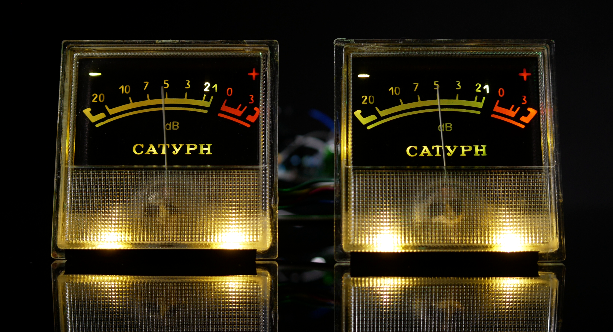
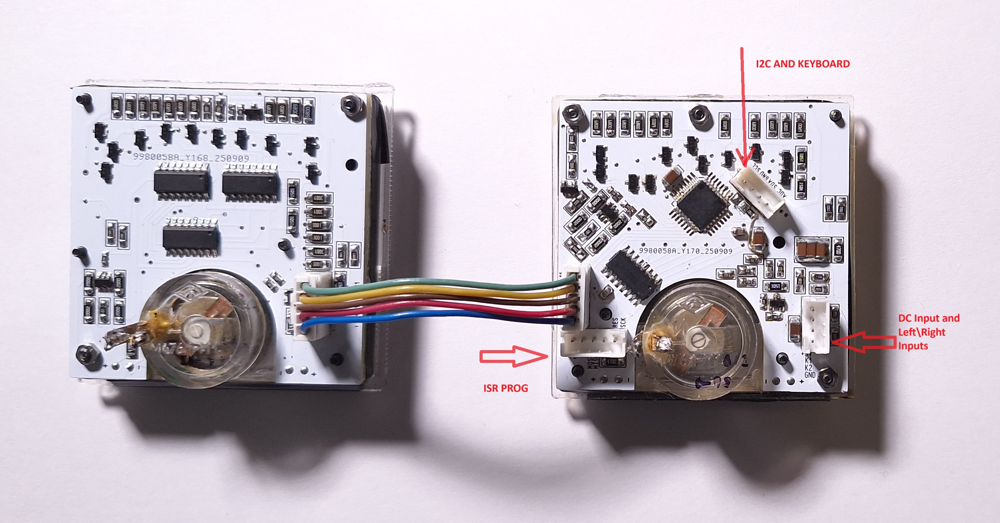
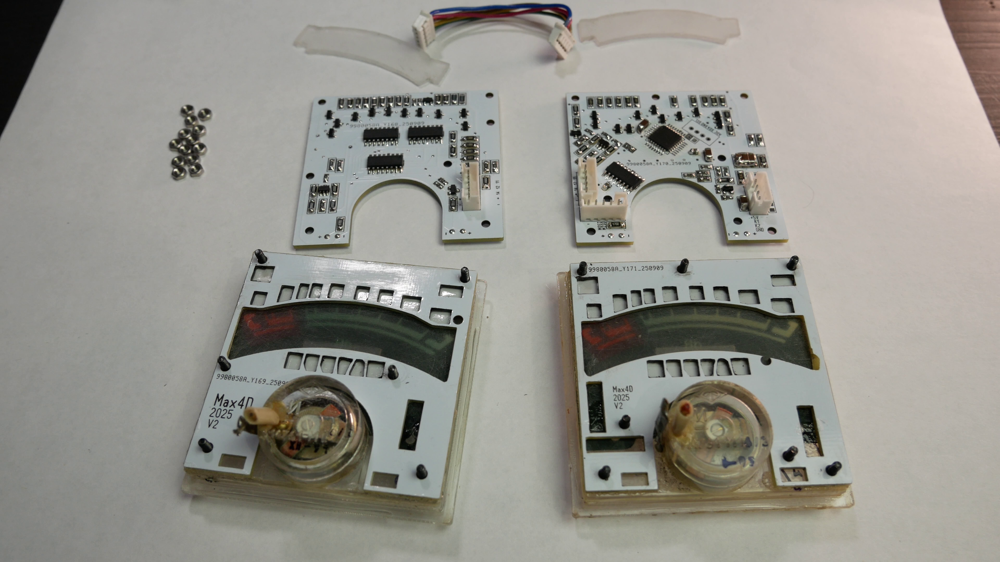
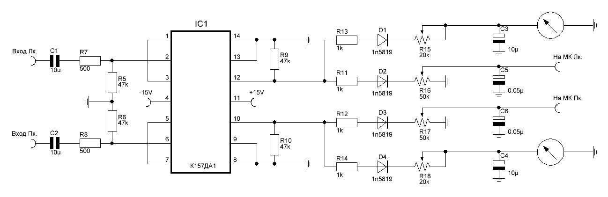
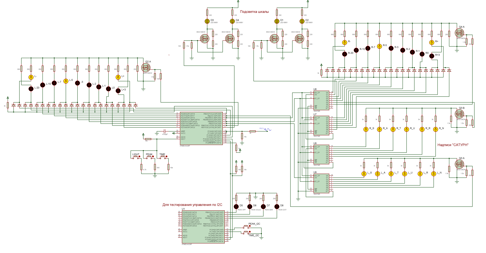

# Saturn-VU
## Материалы по проекту доработки стрелочных индикаторов от катушечного магнитофона «Сатурн 202-2 Стерео»

Код написан на языке C в Atmel Studio 7.0.

В папке `VuMetter` проект стрелочных индикаторов.

В папке `MainModuleTest` тестовый проект для управления индикаторами по шине I2C 
(считывает по шине текущий режим индикаторов и может изменять режим по нажатию кнопок).

[--> Сборка индикаторов показана в видео <--](https://youtu.be/D_wwyefvZ4g)

### Схемы подключения:

### Файлы:
- [Проект в Sprint Layout](files/vu.lay6)
- [Проект в Proteus 8](files/vu_proteus_8.pdsprj)
